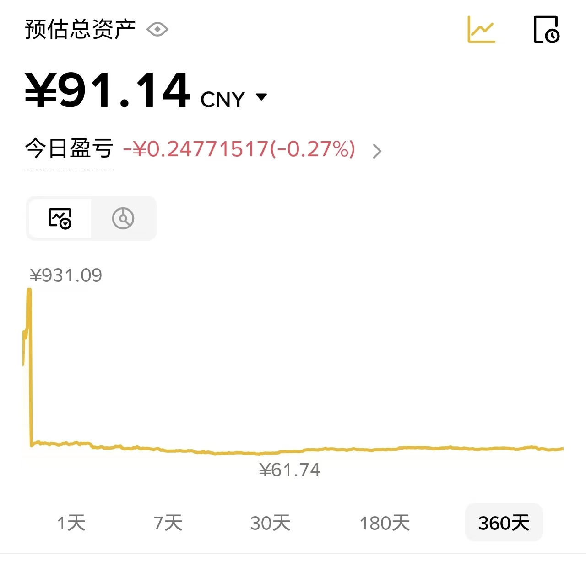

# **一次失败又成功的经历——记第一次数字货币投资尝试**

## **引言：**

在2024年下半年，我开始接触数字货币投资，其瞬间且巨大的潜在利润无疑撩动着一个没有什么资金的年轻大学生的心，为此，我开始了小一个学期的数字货币投资，并且前前后后总共投资了一千多块钱。虽然最终我选择了退出，但这次经历无疑是给我上了人生中重要的一课。

## **第一部分：初次接触区块链**

其实我第一次真正接触区块链与数字货币是在2023年的大一上学期，在百团大战中，我认识到了学校的区块链协会，由于当时给的礼品比较好，我选择了加入了他们的微信群。群里每天都会有群主分享信息，有时是数字货币相关，有时也会有别的时事，但那会我还没有太当回事，只是出于打破信息差的目的有一搭M一搭的关注一下群里的信息。

在大一下学期的网络空间导论实践课上，老师需要每一组自选题完成一个期末的大作业，出于对区块链这一新技术的兴趣与对高分的渴望，我完成了一项难度较高的名为区块链重放攻击的项目，其实最终就是用remix-IDE平台模拟了一个简单的重放攻击并在课堂上进行了演示，最终，我获得了不错的分数。而在项目的推进中，我无疑对数字货币有了更深的认识，并产生了一定的好奇，不过我此时还是没有真正开始投资数字货币。

## **第二部分：第一次投资**

真正让我下定决心投资真钱进去的是一条新闻：单个比特币价钱突破90000美元！要知道在十年前它还只有500美元啊！当时我简直震惊了，一个比特币竟然有如此高的价值，而且我认定未来比特币肯定会持续提升的，因为我认为其背后所代表的思想会成为未来的主流，即去中心化。以前老话说得好，最好的努力时间是十年前，其次是现在，我当时觉得这句话对于比特币也适用。于是，在对赚钱的的渴望下，我投资了500块钱进去，开始了我的投资之旅。

在平台选择上，我是通过币安进行投资的，通过c2c直接找币安里面的广告直接用支付宝或者微信进行的购买。一开始，我只是想要赚点小钱就行，换言之，此时的我更多是在尝试，想看看以比特币为代表的数字货币到底真的是否如外界传闻所说升值这么飞快，与此同时，我也把一些钱存在了余额宝和零钱通里。此时，我还是比较求稳的。

而随着时间推移，比特币和以太坊的价值都涨了一些，我也对于这笔投资更加有信心了。

## **第三部分：接触山寨币**

虽然比特币和以太坊让我此时赚了小几十块钱，但是随着我在币安上浏览的越多，一种价值提升与下降极快的币种进入了我的视野：山寨币。此种币一般是由个人推出，其价值可以在一夜之间瞬间涨30%之多！在看了几次币安上24h涨幅榜后，耐不住诱惑的我把一部分的比特币与以太坊换成了山寨币，并追加投进了200块钱进去。

我记得我当时投的是一个名为pepe的币，其头像是悲伤青蛙的表情，我投资这个币的原因是基于其这一段时间的价值趋势，pepe不断的上涨让我对其潜力拥有了充足的信心。

一开始投资进去，第二天pepe就让我收获了几十块钱的利润，这让我不禁十分欣喜。虽然我不敢进行那种杠杆类的投资，但是这种利润的提升还是让我十分欣喜，最终我也陆陆续续地投进去一些小钱在山寨币上。并且，随着投资的深入，我在币安上面花费的时间也越来越多，从以前早上起来和晚上睡觉前看一下，变成一般上课的时候都要检查个两三次，不仅看价格波动，还看广场上的人展望着这个币的潜力，并且深深地坚信它的升值潜力。虽然我投资的钱还没有1000块，但是，对于那种瞬间巨大利益的渴求，还是让我当时深深的沉溺在了其中。此时数字货币已经给我带来了上百的收益，而我也陆陆续续的换了几种山寨币来投。

## **第四部分：市场的波动，散户的噩梦**

投资了快两个月的时候，一天我照常起来，打开手机里的币安，首页上的金额瞬间让我睁大了双眼。跌了这么多！不仅利润全无，就连本金也亏了非常多！一瞬之间蒸发的钱，让我脑子有点发懵。点开具体的数字货币，基本市面上所有的币都跌了，比特币、以太坊还只是小跌，我投资的几个山寨币全部大跌，并且此时还在随着时间推移不断下降。

但是，此时的我也没有什么沮桑的情绪，毕竟从开始投资的那一刻起，我就知道数字货币尤其是山寨币的上升与下跌是极为迅速的，于是我整理好情绪，赶紧又投资了500块钱进去，不过这次，我不再想着赚大钱了，而是想着赶紧把投的钱拿回来然后赶紧撤出去。因为在今天之前，我也渐渐的感觉到随着投资的时间推移，数字货币已经深深影响到我本来正常的生活，无论是上课还是平时学习，我总是忍不住拿起手机看看现在行情怎么样了，这次大跌也让我下定决心从其之中抽离出来。

最终，在几天之后，几个数字货币的价值回升了一些，我也把之前赔的本金都拿了回来。于是在2024年11月7日这一天，我把大部分本金都取了出来，结束了这一段数字货币投资之旅。

## **尾声**

时至今日，我的币安账户里还留着100块钱。它不再是投资，更像是一个“纪念碑”，标记着我曾经的这段经历。从那次之后，我再也没有往里投过一分钱。我必须承认，我仍然十分看好数字货币和区块链这一领域。虽然无法预测未来，但我仍然对其充满了技术上的希望。但是，这种波动剧烈的投机游戏，对于我这样一个穷大学生来说，风险还是太高了。它所带来的精神内耗，远超过了我所能承受的范围。

这次投资，如果从金钱回报上来看，无疑是“失败”的。我折腾了近两个月，耗费了无数精力，最终几乎是原路返回，一无所获。但从人生成长的角度看，这无疑是“成功”的。我用一千块钱的本金，亲身经历了一场完整的投机泡沫周期。我认识到了自己的认知边界，看清了人性的贪婪与恐惧，更明白了“专注当下”和“投资自己”才是这个阶段最重要的事情。这堂课，远比任何教科书都来得深刻。

也许在未来工作后，当我有更强的抗风险能力和更充足的“闲钱”时，我我会重新审视数字货币，但那时，我将是以一个真正“投资者”而非“投机者”的身份入场。但现在，作为一个学生，我还是做一个心态平和的旁观者吧。

完

